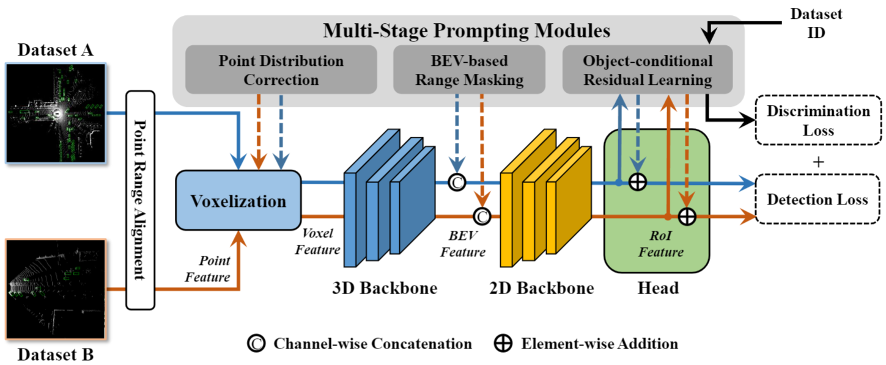

# Uni<sup>2</sup>Det: Unified and Universal Framework for Prompt-Guided Multi-dataset 3D Detection (ICLR 2025)

[Yubin Wang](https://thomaswangy.github.io/)$^1$\*, [Zhikang Zou](https://bigteacher-777.github.io/)<sup>2</sup>\*, [Xiaoqing Ye](https://shuluoshu.github.io/)<sup>2</sup>, [Xiao Tan](https://scholar.google.com/citations?user=R1rVRUkAAAAJ)<sup>2</sup>, [Errui Ding](https://scholar.google.com/citations?user=1wzEtxcAAAAJ)<sup>2</sup>, [Cairong Zhao](https://vill-lab.github.io/)$^1$

<sup>1</sup>Tongji University, <sup>2</sup>Baidu Inc.  *Equal Contribution

Official implementation of the paper "[Uni2Det: Unified and Universal Framework for Prompt-Guided Multi-dataset 3D Detection](https://arxiv.org/abs/2409.20558)".


<hr />

## 📢 News

* **(Feb 13, 2025)**
  - Training and evaluation codes for Uni<sup>2</sup>Det are released 🔓
* **(Jan 23, 2025)**
  * Paper accepted at ICLR 2025 :tada: 

## ✨ Highlights


> **<p align="justify"> Abstract:** *We present Uni<sup>2</sup>Det, a brand new framework for unified and universal multi-dataset training on 3D detection, enabling robust performance across diverse domains and generalization to unseen domains. Due to substantial disparities in data distribution and variations in taxonomy across diverse domains, training such a detector by simply merging datasets poses a significant challenge. Motivated by this observation, we introduce multi-stage prompting modules for multi-dataset 3D detection, which leverages prompts based on the characteristics of corresponding datasets to mitigate existing differences. This elegant design facilitates seamless plug-and-play integration within various advanced 3D detection frameworks in a unified manner, while also allowing straightforward adaptation for universal applicability across datasets. Experiments are conducted across multiple dataset consolidation scenarios involving KITTI, Waymo, and nuScenes, demonstrating that our Uni<sup>2</sup>Det outperforms existing methods by a large margin in multi-dataset training. Notably, results on zero-shot cross-dataset transfer validate the generalization capability of our proposed method.* </p>

## :rocket: Contributions

- We introduce a novel training paradigm for 3D object detection which focuses on unified and universal multi-dataset training, aiming at enhancing the performance in MDT settings; 
- We present Uni<sup>2</sup>Det, a novel framework on 3D detection with multi-stage prompting modules for prompting various components in a detector including voxelization, backbone and head, enabling robust performance across diverse domains and generalization to unseen domains;
- Experiments conducted across multiple dataset consolidation scenarios involving KITTI, Waymo, and nuScenes demonstrate that Uni<sup>2</sup>Det significantly outperforms existing methods in multi-dataset training, especially on the generalization capability of the model.

## 🛠️ Installation 

For installation and other package requirements, please follow the instructions detailed in [INSTALL.md](docs/INSTALL.md). 

## 🗂️ Data Preparation
Please follow the instructions at [DATASETS.md](docs/DATASETS.md) to prepare all datasets.


## 🧪 Training and Evaluation
Please refer to [RUN.md](docs/RUN.md) for detailed instructions on training and evaluating.

## 🔍 Citation
If you use our work, please consider citing:

```bibtex
@article{wang2024uni,
  title={Uni $\^{} 2$ Det: Unified and Universal Framework for Prompt-Guided Multi-dataset 3D Detection},
  author={Wang, Yubin and Zou, Zhikang and Ye, Xiaoqing and Tan, Xiao and Ding, Errui and Zhao, Cairong},
  journal={arXiv preprint arXiv:2409.20558},
  year={2024}
}
```

## 📧 Contact
If you have any questions, please create an issue on this repository or contact us at wangyubin2018@tongji.edu.cn or zhikangzou001@gmail.com.


## 😃 Acknowledgments

Our code is based on [3DTrans](https://github.com/PJLab-ADG/3DTrans/tree/master) repository. We thank the authors for releasing their code. If you use our model and code, please consider citing these works as well.

